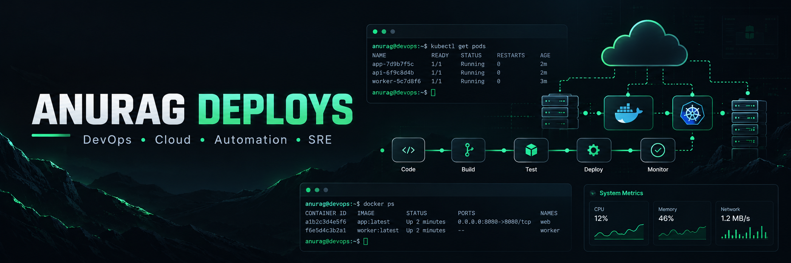

  

<h1 align="center">Hi, I'm Anurag 👋</h1>

<h3 align="center">DevOps & Cloud Learner</h3>

  Building hands-on projects around automation, deployments,
  containers, cloud infrastructure and reliability.

---

## 👨‍💻 About Me

I'm building my DevOps and Cloud engineering skills through
hands-on projects and practical experimentation.

I prefer learning by building real systems, understanding
how the components work together, and documenting the
engineering decisions behind them.

My current focus is on:

- Linux & system administration
- Git & GitHub
- Python
- Docker & containerization
- CI/CD
- AWS
- Automation
- Monitoring & observability
- Reliability and deployment workflows

---

## 🚀 Featured Projects

### 🔧 DevOps Release Orchestrator

A DevOps platform for repository management, release
versioning, automated deployments, health monitoring,
automatic rollback and deployment history.

**Tech:** Python • Flask • Docker • Git • SQLite

🔗 [View Project](https://github.com/anuragdeploys/Devops-Release-Orchestrator)

---

### ☁️ Cloud Cost Optimization Dashboard

A cloud cost monitoring and analysis platform built to
collect, process and visualize infrastructure cost data.

**Tech:** Python • Flask • SQLite • Docker • GitHub Actions

🔗 [View Project](https://github.com/anuragdeploys/cloud-cost-optimization-dashboard)

---

## 🛠️ Technologies & Tools

### Languages
- Python
- Bash

### DevOps & Infrastructure
- Linux
- Docker
- Git
- GitHub Actions
- AWS
- CI/CD

### Development
- Flask
- REST APIs
- SQLite
- SQLAlchemy

### Reliability & Operations
- Monitoring
- Health Checks
- Deployment Automation
- Rollback Strategies
- Troubleshooting

---

## 📚 Currently Learning

I'm continuously improving my practical knowledge of:

- AWS infrastructure
- CI/CD pipelines
- Containerization
- Infrastructure automation
- Monitoring & observability
- System administration
- DevSecOps
- Site Reliability Engineering

---

## 🎯 My Goal

To build strong practical DevOps fundamentals by designing,
building, breaking, troubleshooting and improving real systems.

---

## 📊 GitHub Activity

I use GitHub to document my learning, projects,
experiments and continuous improvement.

---

## 🤝 Let's Connect

I'm always interested in connecting with people working
in DevOps, Cloud, SRE and infrastructure engineering.

📧 Open to learning, collaboration and opportunities.

---

  <i>Build. Automate. Monitor. Improve.</i>

